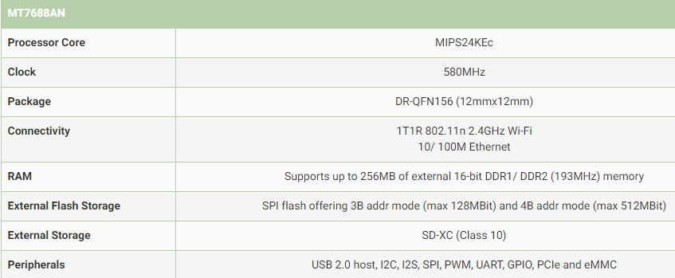

# [MT7688](https://github.com/sochub/MT7688) 
 
#### 内核：[MIPS](https://github.com/sochub/MIPS)
#### 厂商：[mediatek](https://github.com/sochub/mediatek)
#### 芯片定级：[Level](https://github.com/sochub/Level)

## [描述](https://github.com/sochub/MT7688/wiki) 

[MT7688AN](http://labs.mediatek.com/zh-cn/chipset/MT7688)集成了 1T1R 802.11n Wi-Fi radio、580MHz MIPS® 24KEc™ CPU、1-port fast Ethernet PHY、USB2.0 host、PCIe、SD-XC、 I2S/PCM，并支持多种低速输出入接口在单一颗系统单芯片当中。

### 关键参数

* MIPS24KEc 580 MHz，64KB I-Cache与32KB D-Cache
* 支持最大 256MB RAM ，并支持SD-card
* 1T1R 2.4GHz 802.11 Wi-Fi radio with 150 Mbps
* 10/100 FE PHY
* USB 2.0 Host, PCIe 1.1 Root Complex；

器件封装：MT7688AN QFN156 (12mmx12mm)，MT7688KN QFN120 (10mmx10mm)

### [收录资源](https://github.com/sochub/MT7688)

* [文档](docs/)
* [资源](src/)

### [关联资源](https://github.com/sochub)

* [编译工具RISCV-GNU](https://github.com/sochub/RISCV-GNU)

### [选型建议](https://github.com/sochub)

###  [SoC资源平台](http://www.qitas.cn)   
